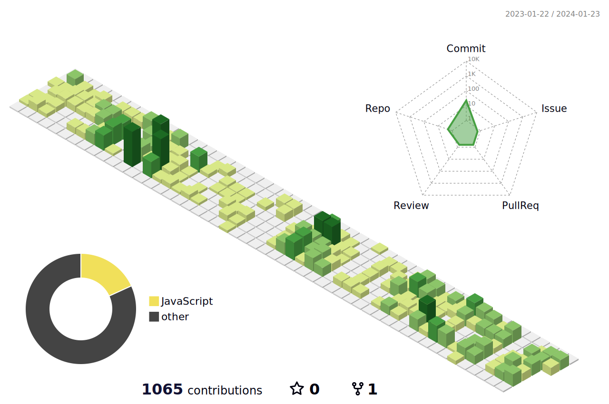

<h1 align='center'> Welcome! </h1>

### 👋 About me:

<h1 align="center">🐙My name is Jefferson ∆"BugaroxD"∆</h1> 
<h3 align="center">I'm Fullstack developer for Brasil</h3>

  

- 👨‍💻 I’m currently working on **Achei Pneus - Desenvolvedor de Software Jr. | Software Developer Jr.**

- 👨‍🎓 I’m currently study **Análise e Desenvolvimento de Sistemas | Analysis and Systems Development**

- 📫 My email: jeffeluiz97@gmail.com

## Connect with me

  

<a href="https://www.linkedin.com/in/jefferson-clemente-a928ab1a4/"> 
	
<a href="mailto:jeffeluiz97@gmail.com"> 
	 <a/>

 
## ⚡ Technologies
<h3 align="left">Languages and Tools:</h3>
	
<table><tr><td valign="top" width="33%">

### Frontend

  
  
  
  
  
  
  
  

</td><td valign="top" width="33%">

### Backend

  
  
  
  
  
    

</td><td valign="top" width="33%">

### DevOps

  
  
  
  
  
  
  
  
  

</td></tr></table>

 

## 📈 Statistics

</img>
</img>

